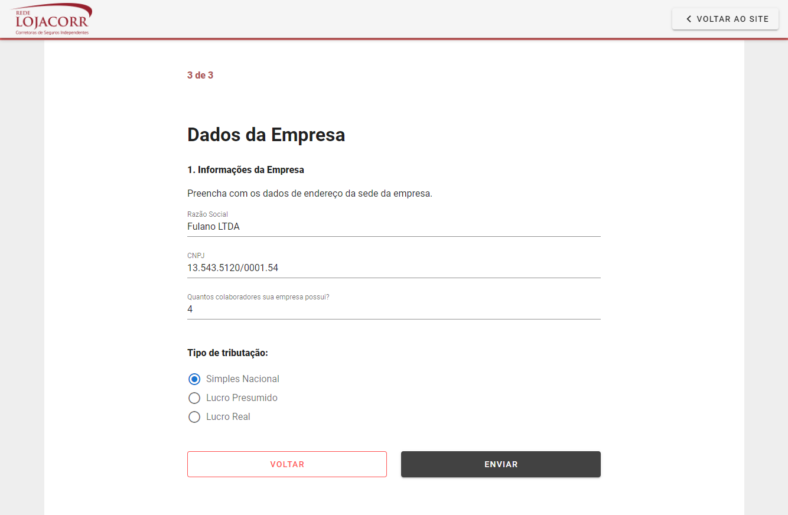

# Projeto Final NuxtJS + Vuetify + Vuex

<hr/>

### Página 1
```
Rota: /home

OBS: O botão próximo é habilitado quando o termo é aceito
```


### Página 2
```
Rota: /form

OBS: O botão próximo é valida os campos obrigatórios(todos)
OBS²: Adicionado máscara nos campos: telefones, rg, cpf e data de nascimento
```


### Página 3
```
Rota: /company

OBS: O botão Enviar é valida os campos obrigatórios(todos)
OBS²: Adicionado máscara nos campos: cnpj
```




### Página de Sucesso
```
Rota: /success

OBS: O botão voltar para o site redireciona para página home(Página 1)
```


### Informações adicionais
```
Botão voltar ao site redireciona para página 1(home)
```

```
As informações do formulário estão sendo gerenciadas pelo VUEX.
```

```
Template utilizado foi Vuetify.
```